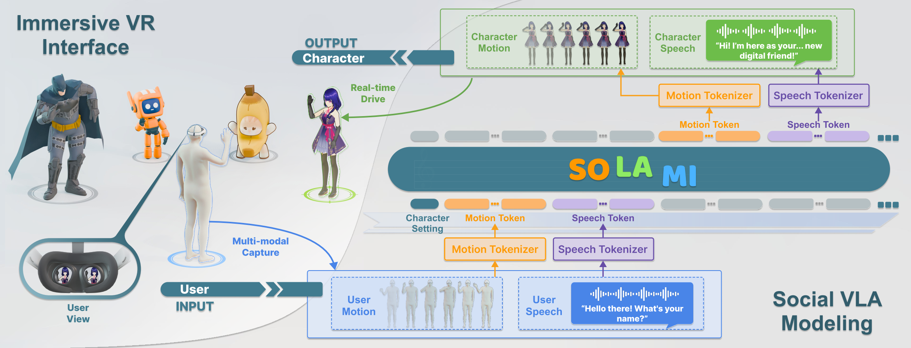
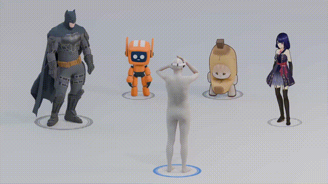
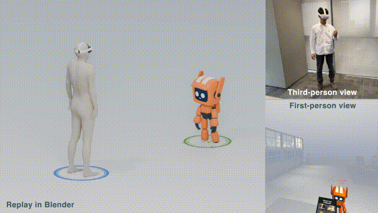
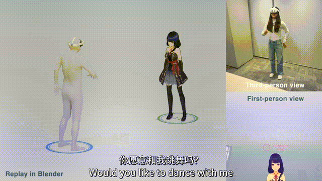
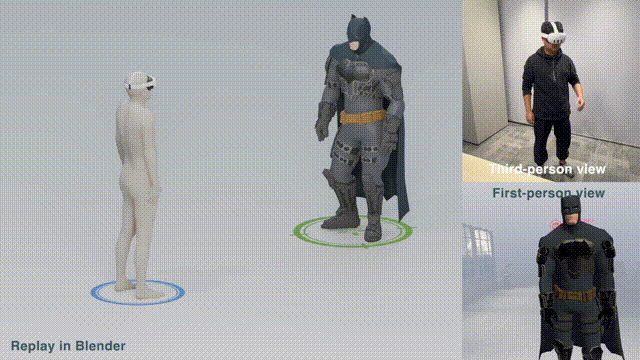
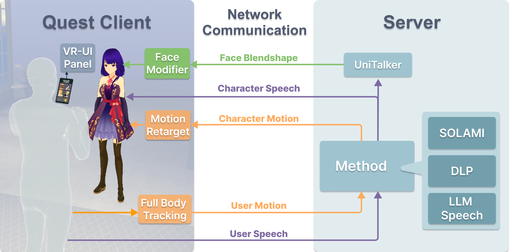

# [CVPR25] SOLAMI: Social Vision-Language-Action Modeling for Immersive Interaction with 3D Autonomous Characters

<div align="center">
    <a href="https://solami-ai.github.io/" class="button"><b>[Homepage]</b></a> &nbsp;&nbsp;&nbsp;&nbsp;
    <a href="https://arxiv.org/abs/2412.00174" class="button"><b>[arXiv]</b></a> &nbsp;&nbsp;&nbsp;&nbsp;
    <a href="https://www.youtube.com/watch?v=P0juJl2Y4So" class="button"><b>[Video]</b></a>
&nbsp;&nbsp;&nbsp;&nbsp;
</div>

Official Code of CVPR 2025 paper *SOLAMI: Social Vision-Language-Action Modeling for Immersive Interaction with 3D Autonomous Characters*.





<div align="center">

<!--  -->

|      Various Characters  |     Comprehension of Body Language    |  Execution of Motion Commands  | Engagement in Interactive Tasks|
| :------------------------------: | :------------------------------:| :------------------------------:| :------------------------------:|
|  |  |   |   |

</div>


## License and Usage Notices
**Open Source Content and Influencing Factors**: In this repository, we provide code for raw data preprocessing, multimodal data synthesis, SOLAMI model training, model evaluation, VR Unity client and server code for community reference.
Considering that we used some company internal data to train the models in the original paper, we are not open-sourcing the raw data and trained models. Users can use their own collected data to train their deployable models on advanced end-to-end multimodal models ([GLM-4-Voice](https://github.com/THUDM/GLM-4-Voice), [Qwen2.5-Omni](https://github.com/QwenLM/Qwen2.5-Omni), etc).
In our VR engineering implementation, we use the company's intranet for forwarding, file reading and writing strategies to achieve communication between client and server. You can design your front-end and back-end strategies according to your infra.
We are eager to open-source a universal version to everyone, but considering our limited time and organizational changes, our current code is still relatively rough. We ask for the community's understanding.


**Usage and License Notices**: This project utilizes certain datasets, 3D assets, and checkpoints that are subject to their respective original licenses. Users must comply with all terms and conditions of these original licenses, including but not limited to the [OpenAI Terms of Use](https://openai.com/policies/terms-of-use) for generating synthetic data scripts, [Llama community license](https://ai.meta.com/llama/license/) for foundation language models, [SMPL-X](https://smpl-x.is.tue.mpg.de/) for original motion format, and [HumanML3D](https://github.com/EricGuo5513/HumanML3D), [Inter-X](https://github.com/liangxuy/Inter-X), [DLP-MoCap](https://digital-life-project.com/), [AnyInstruct](https://huggingface.co/datasets/fnlp/AnyInstruct), [CommonVoice](https://commonvoice.mozilla.org/) for data generation and model training. This project does not impose any additional constraints beyond those stipulated in the original licenses. Furthermore, users are reminded to ensure that their use of the dataset and checkpoints is in compliance with all applicable laws and regulations.


## Contents
- [Install](#install)
- [Data](#data)
- [Model](#model)
- [VR Demo](#vr-demo)

## Install

Environment with Linux 18.04 LTS and cuda 11.8 is tested in our experiment.

Step 1: Install pytorch 

```
conda create -n demo python=3.11
conda activate demo
pip install torch==2.2.2 torchvision==0.17.2 torchaudio==2.2.2 --index-url https://download.pytorch.org/whl/cu118
pip install -U openai-whisper
pip install -r requirements.txt
```

Step 2: Install [TTS](https://github.com/coqui-ai/TTS)

Please follow the instructions from [TTS](https://github.com/coqui-ai/TTS) to install this package. TTS will downgrade numpy.
After you have installed TTS, please install spacy and upgrade numpy.

```
pip install -U spacy
python -m spacy download en_core_web_sm
pip install numpy==1.26.4
```

(Optional) Step 3: Install [vllm](https://github.com/vllm-project/vllm)


## Data

Data processing is very complex work involving numerous details. The overall framework is as follows. For processing code, please refer to [Datasets](./datasets/README.md).

- Speech Data
    - Pretrain Data Preprocessing  (~ 300K items)
    - Character Data Preprocessing
- Motion Data
    - SMPL-X Preprocessing & Feature Extraction (~ 40K motion items)
    - Text Embedding Generation
    - Unified Data Item Generation
- Multimodal Generation
    - Topic Collection  (~ 4K topics)
    - Multimodal Chat Data Synthesis (~6K items)

## Model

Training SOLAMI requires three stages: motion tokenizer training, multitask pretraining, and multimodal chat sft. For details, please refer to [Models](./models/README.md).

### Tokenizer Training
We use the codebase of [MotionGPT](https://github.com/OpenMotionLab/MotionGPT) to train the motion tokenizer. 
For hand or body tokenizer, we apply 1D convolution as the basic layer of VQVAE. For relative transform, we use MLP layers. 
For speech tokenizer, we use the original pretrained tokenizer from[AnyGPT](https://github.com/OpenMOSS/AnyGPT).
Besides the tokenizer training, we also use GPT-2 as foundation model for initial ablation studies. 


### Multi-task Pre-training for Modality Alignment

We adopt multi-task pretraining on LLM backbone to align motion, speech, and language.
To achieve this, we train a 7B decoder-only LLM ([AnyGPT](https://github.com/OpenMOSS/AnyGPT)) on 32 V100s with [DeepSpeed](https://github.com/deepspeedai/DeepSpeed) Zero3 for one day.
During training, we fixed the params of motion & speech tokeniers and adopt full parameter finetuning.

### Instruction Tuning for Multi-turn Conversation

In this stage, we finetune the model with synthetic multimodal chat data to obtain social Vision-Language-Action model for immersive interaction with 3D Characters.
SOLAMI model takes the user's motion and speech (character's observation) as input, and generate the character's motion and speech as response (character's action) based on the system prompt of character settings and dialogue context.


## VR Demo



### VR Client

The VR Client is a standalone Unity project that can be compiled for Quest 2/3/Pro and above devices. It serves as the front-end interface for users to interact with the SOLAMI system in virtual reality.

Repository: [SOLAMI-VRClient](https://github.com/EsukaStudio/SOLAMI-VRClient)

### VR Data Relay

The Relay acts as middleware to establish connections between the VR Client and the Model Server. The Relay communicates with the Model Server through HTTP requests and with the VR Client through Redis.

Repository: [SOLAMI-VRRelay](https://github.com/AlanJiang98/SOLAMI/tree/Weiye-VRServer/demos/VRRelay)

For security reasons, the VR Relay and the SOLAMI model are deployed on separate servers. Users can modify the code according to their requirements to improve communication efficiency.

### Audio-to-Face Algorithm

The audio-to-face animation algorithm used in this project needs to be deployed separately by users. For reference, you can check out the [UniTalker](https://github.com/X-niper/UniTalker) project, which provides a unified model for audio-driven 3D facial animation that can handle various audio domains including clean and noisy voices in different languages.

UniTalker can generate realistic facial motion from different audio inputs and is compatible with the SOLAMI system when properly configured.


### Model Server
We deploy our model server on nodes with 2 GPUs. 
In this repo, we provide SOLAMI deployment based on [vllm](https://github.com/vllm-project/vllm). 
Additionally, we offer a simplified version of the [DLP method](https://github.com/AlanJiang98/DLP-SocioMind) with [llama2-7B-chat](http://huggingface.co/meta-llama/Llama-2-7b-chat-hf) model as the base LLM model, serving as a comparative LLM-Agent approach.

```
cd models/vla/anygpt/infer

# solami model server
python solami_server_model.py

# llm-agent framework
python llama2_server_model.py
```


## Citation

```bibtex
@inproceedings{Jiang2025SOLAMI,
      title={SOLAMI: Social Vision-Language-Action Modeling for Immersive Interaction with 3D Autonomous Characters}, 
      author={Jianping Jiang, Weiye Xiao, Zhengyu Lin, Huaizhong Zhang, Tianxiang Ren, Yang Gao, Zhiqian Lin, Zhongang Cai, Lei Yang, Ziwei Liu},
      booktitle={CVPR},
      year={2025}
}

@inproceedings{Cai2024DLP,
      title={Digital Life Project: Autonomous 3D Characters with Social Intelligence}, 
      author={Zhongang Cai, Jianping Jiang, Zhongfei Qing, Xinying Guo, Mingyuan Zhang, Zhengyu Lin, Haiyi Mei, Chen Wei, Ruisi Wang, Wanqi Yin, Xiangyu Fan, Han Du, Liang Pan, Peng Gao, Zhitao Yang, Yang Gao, Jiaqi Li, Tianxiang Ren, Yukun Wei, Xiaogang Wang, Chen Change Loy, Lei Yang, Ziwei Liu},
      booktitle={CVPR},
      year={2024}
}
```

## Acknowledgement
Our code of SOLAMI is based on [AnyGPT](https://github.com/OpenMOSS/AnyGPT), [HumanTOMATO](https://github.com/IDEA-Research/HumanTOMATO), and [MotionGPT](https://github.com/OpenMotionLab/MotionGPT).

## Related Works

### Research
- [Digital Life Project](https://digital-life-project.com/)&nbsp;: First LLM-Agent framework for building 3D autonomous characters.
- [ChatHuman](https://chathuman.github.io/)&nbsp;: A multi-modal LLM for understanding humans with the assistance of tools.
- [Generative Agents](https://github.com/joonspk-research/generative_agents)&nbsp;: An architecture for interactive simulacra of human behavior.

### Products \& Company
- [SEELES](https://www.seeles.ai/)&nbsp;: End-to-end 3D game AI engine generating 3D games with a single sentence, igniting hyper-personalized social gaming.
- [MeshCapade](https://meshcapade.com/)&nbsp;: Foundation models that enable digital humans to see, understand, and move.
- [Whispers from the Star](https://wfts.anuttacon.com/)&nbsp;: AI dialogue-based text adventure game.

