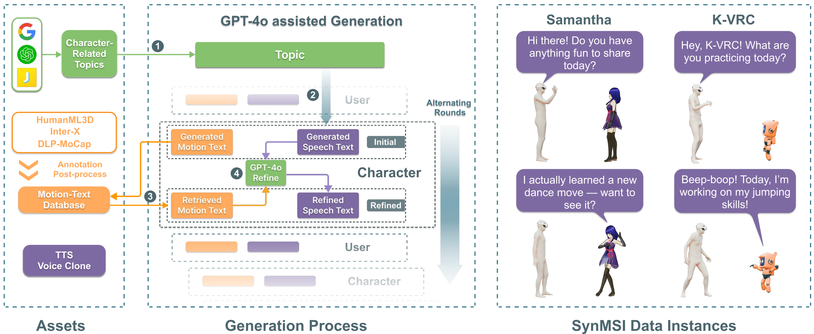

# Datasets

Datasets include speech data, motion data, and multimodal chat data. 
- Speech data is used for training stage 2 to align speech with language and voice cloning to generate multimodal chat data. 
- Motion data is used for three stages: training the motion tokenizer, aligning motion with language in multi-task pre-training, and synthesizing multimodal chat data. 
- Multimodal chat data is used for training stage 3, enabling the model to learn multimodal role-playing capabilities.




## Speech Dataset


### Pretrain Speech Data


### Character Speech Data


## Motion Dataset

### Step 1: smplx preprocess
```
python raw_process_xxxxx_1.py --gpu_id 0 --period 4 --part 0
```

Note that for parallel processing, we divide the dataset into {period} parts.
In this step, we get joints (30 fps) from smplx parameters.

### Step 2: feature extraction
```
python raw_process_xxxxx_2.py --gpu_id 0 --period 4 --part 0
```

In this step, we retarget all the joints to the template '000021.npy' in HumanML3D dataset. We obtain the features (rotations, velocities, etc) from the joint sequences. Otherwise, we save the scale, relative translation in the procedure.

```
python calculate_mean_variance.py
```

Calculate the mean and standard variance of the feature.

### Step 3: Inter-X annotation process
We first divide the overall descriptions into seperate descriptions for each person using LLM.
```
python inter_x_annot_process.py --period 8 --part 0
```
Since the processing will cause some issues, such as misorder of actor and reactor, unreasonable divisions, we use LLM to revise the issues in a voting strategy.
```
python inter_x_annot_post_process.py --period 12 --part 0
```

### Step 4: embedding generation
We generate text embeddings for all the text descriptions for retrieval (Multimodal dialogues generation, motion retrieval in 3D LLM-Agent).
```
python text_embedding_xxxxx.py  --period 4 --part 0
```
Then merge all the embeddings.
```
python text_embedding_merge.py
```

### Step 5: unified dataset items generation
To process all the data into the same format, run this script:

```
python datasets_items_gather.py
```

The item of the dataset is as follow:
```
dict(
    motion_name=dict(
                dataset=str,
                motion_name=str,
                motion_data_path=str,
                split_in_original='', #train, val, test
                
                text=list,
                tokens=list,
                both_text=list,
                emotion=str, # （
                
                start_frame=int, 
                end_frame=int,
                fps=int,
                interactive_start_frame=int, 
                interactive_end_frame=int,
                
                actor=str, (Y,N, Null)
                last_partner_motion_name=str,
                next_partner_motion_name=str,
                 ),
)
```


## Multimodal Data Generation


We use three solutions:
- `Data generation from MoCap datasets and GPT-4o` : Use MoCap datasets with text captions to generate multi-modal interaction scripts.

- `Data generation from internet videos` : Use mocap models to extract human motions from internet videos to generation multi-modal data.

- `Real data collection from MoCap Settings` : Use mocap equipments to collection real-world multi-modal data.

<!-- ## Preparation

**Environment**
```
pip install pytrends openai pandas json tqdm
``` -->

### Step 1: Topic Collection

**Topic Collection from Google Trends**
```
python ./data_gen/topic_collection/google_trends_daily.py
```

**Topic Filter**
```
python ./data_gen/topic_collection/topic_filter.py
```

### Step 2: Data Generation from MoCap Datasets & GPT-4o

Codes are in direction `data_gen`.
You can run the following command to generate synthetic data.
```
python .data_gen/script_gen.py --profile_data_path $YOUR_PROFILE_PATH --config_path $YOUR_CONFIG --exper $EXPERIMENT_NAME --output_dir $OUTPUT_DIR
```

- `--profile_data_path `: The profile includes the topics, user settings etc. which are vital for generating diverse and infromational scripts.

- `--config_path`: You can manually set the experiment configs, including LLM API, content type, allowed interaction, datasets, conversation generation methods, and etc.

