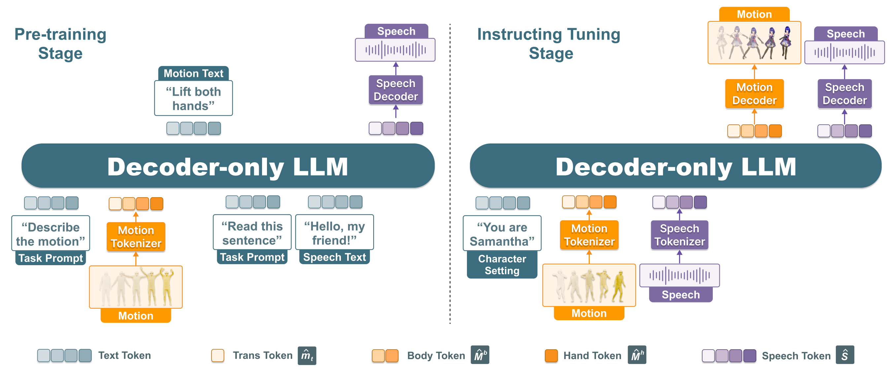

# Model



## Stage 1: Tokenizer Training

### Motion Tokenizer
Please follow [MotionGPT](https://github.com/OpenMotionLab/MotionGPT) to download corresponding assets (model weights in `deps`) for motion tokenizer training and original ablation studies.


```
cd models/motiongpt

python train.py --cfg ./configs/config_h3d_stage1_local_body_hand_sep_trans.yaml --nodebug
```

After training the motion tokenizer, we preprocess all the motion into motion tokens.
```
python scripts/get_motion_code_for_7Bpretrain.py

python scripts/post_process.py
```

**Ablation Studies on MotionGPT**: We adopt ablation studies (results shown in Section B in the supplementary material of SOLAMI paper) on MotionGPT codebase.
It's worth noting that we used the GPT-2 medium model, which has a lower text and instruction understanding capability compared to the Llama2-7B model. For more rigorous ablation experiments, we recommend using base models with stronger text comprehension abilities.


### Speech Tokenizer

We adopt the original speech tokenizer of [AnyGPT](https://github.com/OpenMOSS/AnyGPT). Please download the pretrained model weights.

## Stage 2: Multi-task Pre-training for Modality Alignment

Since we train our model on SenseTime Cloud, users could modify the scripts for their own computation clusters.

In this stage, we train the multimodal LLM with six tasks (motion understanding, text-to-motion generation, motion-to-motion generation, text-to-speech, automatic speech recognition, and speech-to-speech) for modality alignment.

```
cd  models/vla/scripts

bash stage1_pretrain_multinode.sh
```


For pretrained model inference, 
```
cd models/vla/anygpt/infer
bash pretrain_inference.sh
```
To evaluate the pretrained model on multiple tasks, 
```
cd models/vla/anygpt/infer
python pretrain_evaluation.py
```

## Stage 3: Instruction Tuning for Multi-turn Conversation
For instruction tuning, we adopt two options: full parameter finetuning and LoRA finetuning.

```
cd  models/vla/scripts

# full parameter finetuning
bash stage2_it_full_deepspeed_multinode.sh

# lora 
bash stage2_it_lora_deepspeed.sh
```

For SOLAMI model inference,
```
cd models/vla/anygpt/infer
bash conv_inference.sh
```

For model quantitative evaluation,
```
cd models/vla/anygpt/infer

# evaluation of motion
bash conv_evaluation.sh

# evaluation of speech
bash gpt-4o-evaluation.sh

# calculate the final metrics
python metric_calculation.py
```

